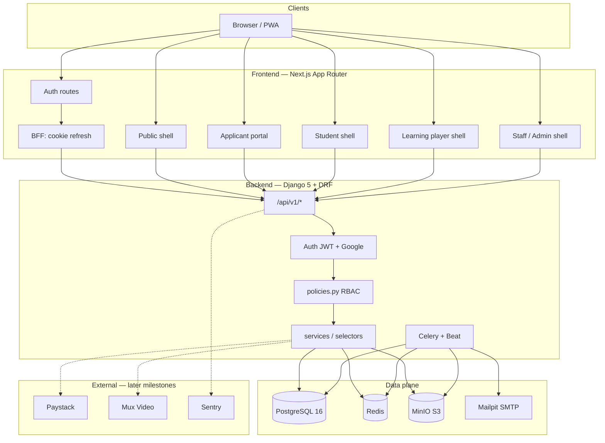
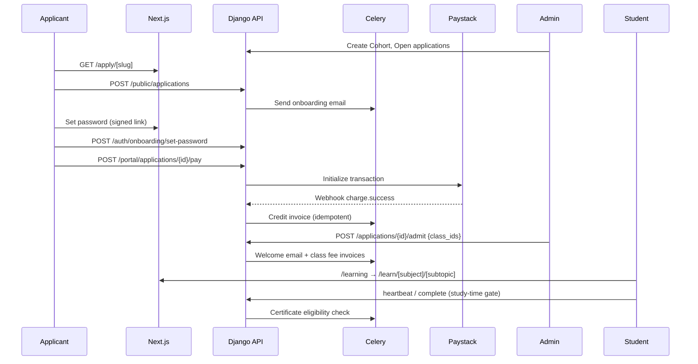

# Imo Ijinle Academy LMS — Architecture

System architecture for the Spirit Science / Educational Portal pillar of the Imo Ijinle ecosystem (IMO-2026-SPEC). Designed as a self-contained product with OIDC-ready auth and search-indexable content for Phase 4 SSO + Unified Search.

## System diagram



## Module map

| Path | Responsibility | Milestone |
|------|----------------|-----------|
| `backend/config/` | Settings split, URLs, Celery, ASGI | M0 |
| `backend/apps/accounts/` | User, roles, invitations, auth endpoints | M0 |
| `backend/apps/audit/` | Immutable AuditLog + helpers | M0 |
| `backend/apps/orgsettings/` | BrandSettings, SiteSettings, FeatureFlags | M0 |
| `backend/apps/common/` | UUID base models, error envelope, pagination | M0 |
| `backend/apps/admissions/` | Cohort applications, onboarding, admit | M2 |
| `backend/apps/programs/` | Cohort (= academic session), Class | M1 |
| `backend/apps/courses/` | Subject Library, ClassSubject, Topic, Subtopic | M1–M3 |
| `backend/apps/content/` | Assets, uploads, document conversion | M3 |
| `backend/apps/learning/` | ItemProgress, VideoProgress, Q&A, notes, study-time gate | M4 |
| `backend/apps/payments/` | Paystack, fee rules, invoices, webhooks | M2/M5 |
| `backend/apps/assessments/` | Quizzes, assignments, gradebook | M6 |
| `backend/apps/certificates/` | Designer, render, verify | M7 |
| `backend/apps/comms/` | Email/push templates, announcements | M8 |
| `frontend/src/app/(public)/` | Marketing, apply, verify | M0+ |
| `frontend/src/app/(auth)/` | Login, register, password, onboarding | M0+ |
| `frontend/src/app/(student)/` | Dashboard, My learning, payments | M0/M4 |
| `frontend/src/app/learn/` | Udemy-style player shell (ink tokens) | M0/M4 |
| `frontend/src/app/(admin)/` | Staff/admin shell + course workspace | M0/M1/M3 |
| `frontend/src/app/portal/` | Applicant portal | M2 |
| `infra/` | Docker Compose, CI | M0 |

## Content hierarchy (v1.2 — authoritative)

```
Cohort  (= academic session / intake; product root)
 └─ Class
     └─ Subject  (= Udemy Course)
         └─ Topic  (= Section)
             └─ Subtopic  (= Lecture) + Quiz/Assignment siblings
```

There is no Program entity in the product model. A legacy `Program` DB table may still exist for older migrations; new data must not use it.

## Data flow: apply → admit → pay → learn → certify



## Queue / task map

| Queue | Tasks | Milestone |
|-------|-------|-----------|
| `default` | Generic async work | M0 |
| `email` | Onboarding, welcome, payment receipts, reminders | M2+ |
| `media` | Document conversion (LibreOffice), virus scan, Mux webhooks | M3 |
| `payments` | Paystack webhook processing, reconciliation | M2/M5 |
| `certificates` | PDF/PNG render, email delivery | M7 |
| Beat | Reminder offsets, reconciliation, cleanup expired tokens | M2+ |

## Environment matrix

| Concern | Dev | Staging | Prod |
|---------|-----|---------|------|
| Settings module | `config.settings.dev` | `config.settings.prod` | `config.settings.prod` |
| Database | Compose Postgres | Managed Postgres 16 | Managed Postgres 16 |
| Cache / broker | Compose Redis | Managed Redis | Managed Redis |
| Object storage | MinIO | S3-compatible | S3-compatible |
| Email | Mailpit | SMTP / SES | SMTP / SES |
| Payments | Paystack test | Paystack test | Paystack live |
| Video | Mux test | Mux | Mux |
| Base URL | `http://localhost:3000` | staging host | `learn.imoijinle.com` (default) |
| Cookie domain | `localhost` | staging domain | env-driven |
| CORS | localhost origins | staging origins | prod origins |

## Auth model (M0)

- Email/password + Google (allauth)
- JWT access token (15 min, memory on client)
- Rotating refresh token in httpOnly cookie
- Roles via `RoleAssignment(user, role, scope_type, scope_id)`
- Central `policies.can(user, action, obj)`
- OIDC-provider-ready hooks for Phase 4 SSO

## API contract

- Prefix: `/api/v1/`
- OpenAPI via drf-spectacular
- Frontend types: `openapi-typescript` + `openapi-fetch` (`make gen-api`)
- Error envelope: `{ code, message, fields, request_id }`
- Money: integer kobo + ISO currency; never floats
- Time: store UTC; default display `Africa/Lagos`
